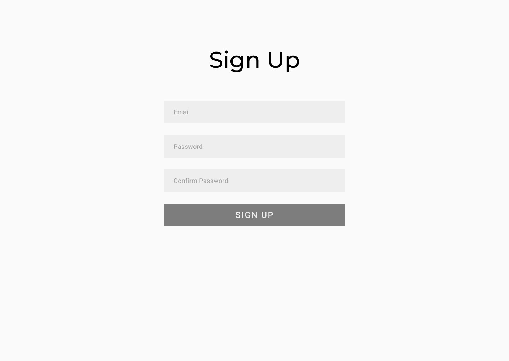
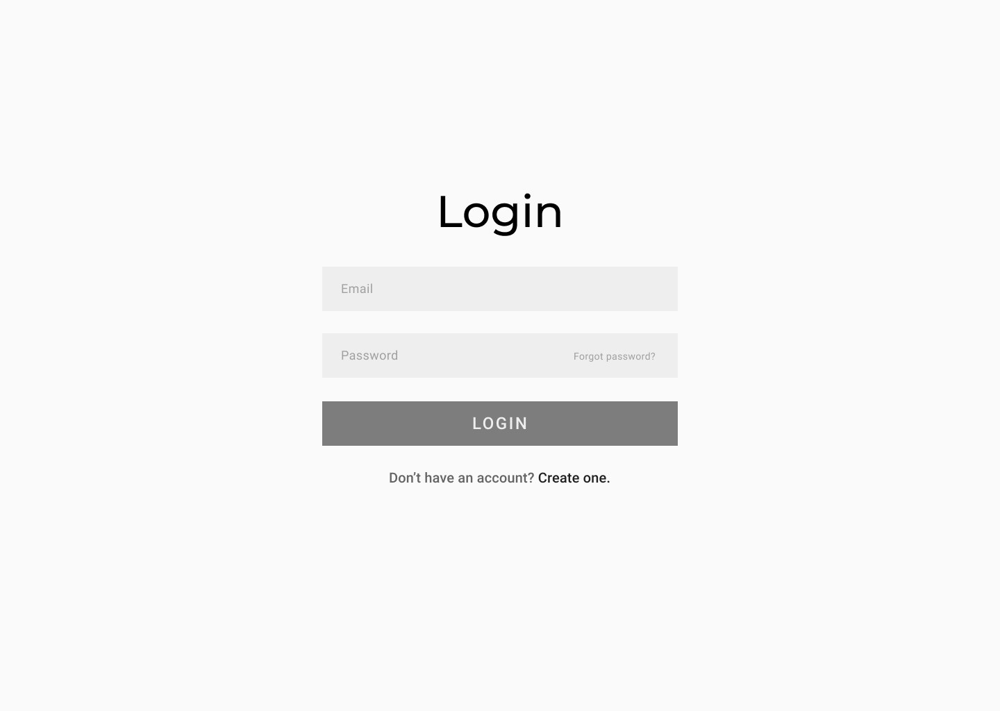
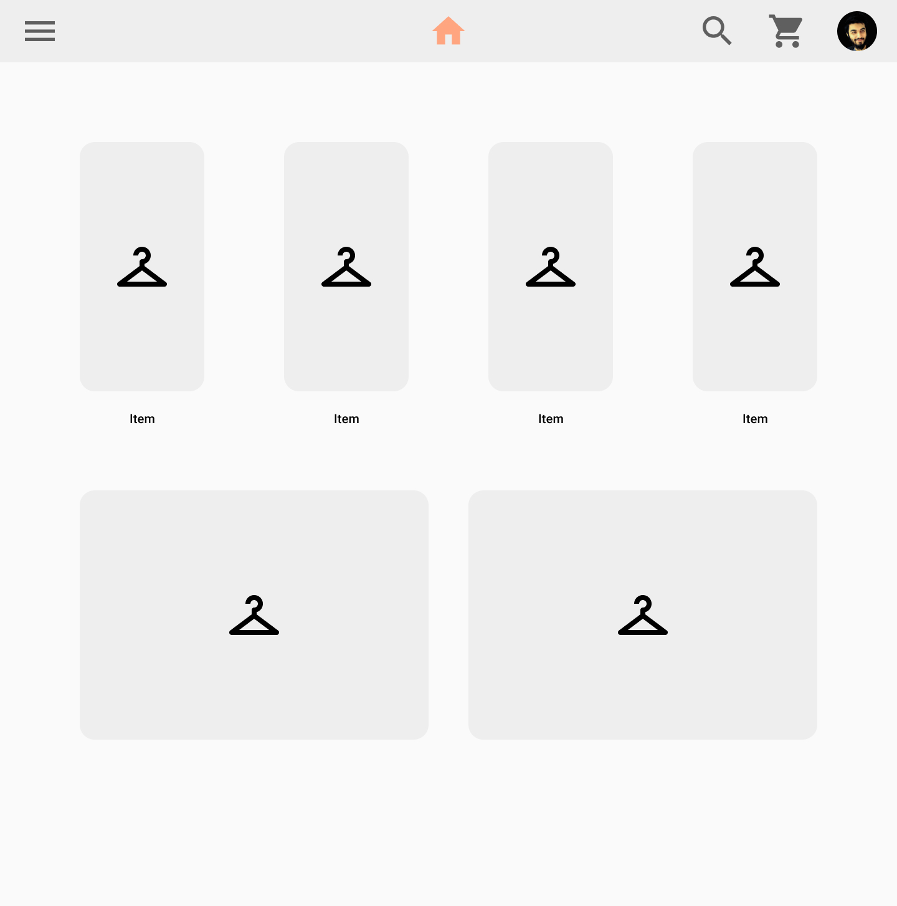
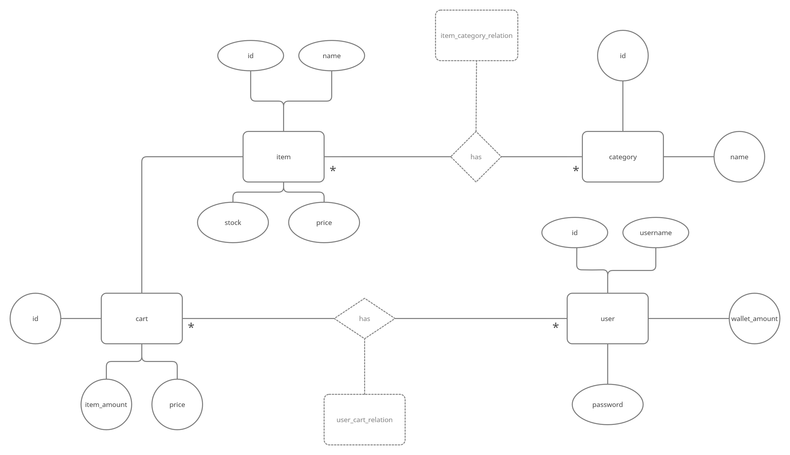

# Projektplan

## 1. Projektbeskrivning (Beskriv vad sidan ska kunna göra).
Tänkte göra någon slags webbshop (bra exempel är lttstore.com). Man skall kunna skapa ett konto med username och password, och logga in. Det skall finnas produkter med varsin pris, lagermängd och olika kategorier. Man skall också kunna lägga dessa produkter i en varukorg, och köpa alltihop. Användaren har en mängd av pengar som kan spenderas, och denna mängden subtraheras med totala kostnaden av varukorgen.
## 2. Vyer (visa bildskisser på dina sidor).

## 3. Databas med ER-diagram (Bild på ER-diagram).

https://app.creately.com/diagram/18ar9wsUNKW/edit <<-- min personliga länk till filen
## 4. Arkitektur (Beskriv filer och mappar - vad gör/innehåller de?).

Inom "app.rb" finns all logik och interaktion med databasen.

Inom "views" finns två mappar, "store" och "users". Inom "users" finns .slim filerna för registrering och inloggning av användare. Inom "store" finns alla .slim filer som har med huvudfunktionen av sidan att göra (webshop). index.slim visar förstasidan av webshoppen, med items från databasen. I new.slim laddar sidans admin upp nya items med varsin namn, bild, lager, kategori och pris. I order.slim visas alla items som man har lagt till i sin varukorg. I show.slim visas en specifik item, baserat på den item_id som det item man klickat på har.

I "public" mappen står alla ikoner ("img"), SCSS ("css"), eventuell JS ("js")  och uppladdade bilder för items ("uploads")
